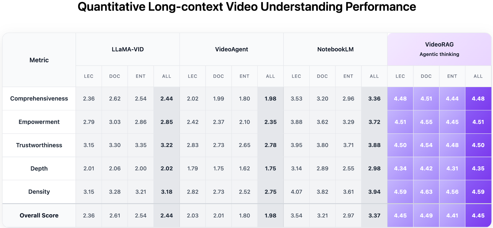

<div align="center">
  <picture>
      
  </picture>
  
  <h1>Vimo: Chat with Your Videos</h1>
  

  [](package.json)
  []()
  []()
  [](https://arxiv.org/abs/2502.01549)
  [](https://github.com/HKUDS/VideoRAG)
  [](https://github.com/HKUDS/Vimo)

</div>

## 1. Introduction

Vimo is a state-of-the-art agentic video understanding platform with intelligent conversational capabilities and comprehensive video analysis. Built upon the advanced [VideoRAG](https://github.com/HKUDS/VideoRAG) technology from HKUDS, Vimo achieves exceptional performance across video comprehension, content extraction, and interactive QA tasks while being meticulously optimized for real-world deployment scenarios.

<div align="center">
  <a href="https://www.youtube.com/watch?v=T9yo4mY2cms">
    
  </a>
</div>

### Key Features

* **Agentic Intelligence**: Specifically designed for conversational video analysis, autonomous content understanding, and intelligent user interaction.
* **Multi-modal Processing**: Advanced fusion of visual, audio, and temporal information for comprehensive video understanding.
* **Real-time Interaction**: Optimized for responsive user experience with efficient query responses.

### Core Technology

Vimo is powered by [VideoRAG](https://github.com/HKUDS/VideoRAG), which is a retrieval-augmented generation framework specifically designed for processing and understanding extremely long-context videos. For detailed performance comparison, please refer to our [paper](https://arxiv.org/abs/2502.01549).

<div align="center">
  <picture>
      
  </picture>
</div>

## 2. Quick Start

### Option 1: Install Vimo App & Run it

> [!NOTE]
> We are starting with a **Beta version** and will continuously improve our Vimo based on feedback and suggestions from the open-source community. The first packaged release will be available once we complete our preparations.
> Future releases will be available for **macOS Apple Silicon** first, with Windows and Linux versions coming later!

<div align="left">
  <a href="https://github.com/HKUDS/Vimo">
    
  </a>
</div>

The packaged version will be available soon! In the meantime, please use Option 2 to run Vimo from source code.


### Option 2: Run Vimo from Source Code

> [!NOTE]
> Ensure the backend service is running before launching the frontend application.
> This setup has been tested and verified to work seamlessly on macOS with M1 chips.

#### Step 1: Set Up and Start Backend Service

Since Vimo utilizes a Python-based VideoRAG server as its backend, please follow the steps below to create the appropriate Python environment:

```bash
conda create --name vimo python=3.11
conda activate vimo

# Core numerical and deep learning libraries
pip install numpy==1.26.4 torch==2.1.2 torchvision==0.16.2 torchaudio==2.1.2

# Video processing utilities
pip install moviepy==1.0.3
pip install git+https://github.com/Re-bin/pytorchvideo.git@58f50da4e4b7bf0b17b1211dc6b283ba42e522df
pip install  --no-deps git+https://github.com/facebookresearch/ImageBind.git@3fcf5c9039de97f6ff5528ee4a9dce903c5979b3

# Multi-modal and vision libraries
pip install timm ftfy regex einops fvcore eva-decord==0.6.1 iopath matplotlib types-regex cartopy

# Audio processing and vector databases
pip install neo4j hnswlib xxhash nano-vectordb

# Language models and utilities
pip install tiktoken openai tenacity dashscope

# Server
pip install flask psutil flask_cors setproctitle
```

Once the environment is set up, start the VideoRAG server using the following commands:

``` bash
# Navigate to backend directory and start API server
cd python_backend
python videorag_api.py
```

#### Step 2: Launch Frontend Application

After successfully starting the backend service, proceed to launch the frontend application by running the following commands in the project root directory:

```bash
# Install dependencies
pnpm install

# Start development server
pnpm dev
```

> ⚠️ **File Location Notice (Current Version)**: Once a video is imported into Vimo, avoid moving or renaming the video file on your computer. In the current beta version, changing the file path may disrupt Vimo's ability to access the video. This limitation will be addressed in future releases.

## 3. Contribution

We embrace the open-source spirit and welcome contributions from the community! Whether you're fixing bugs, adding features, improving documentation, or suggesting enhancements, your contributions help make Vimo better for everyone.

🤗 Feel free to submit issues and pull requests!

## 4. Acknowledgement

We would like to express our gratitude to the following open-source projects that have inspired and contributed to Vimo's development:

- **[nano-graphrag](https://github.com/gusye1234/nano-graphrag)**: For providing innovative algorithms and techniques that enhanced our video understanding capabilities.
- **[uitars-desktop](https://github.com/bytedance/UI-TARS-desktop)**: For inspiring our frontend development approach and providing valuable insights into desktop application architecture.

Thank you to these amazing projects and their contributors! 🙏
